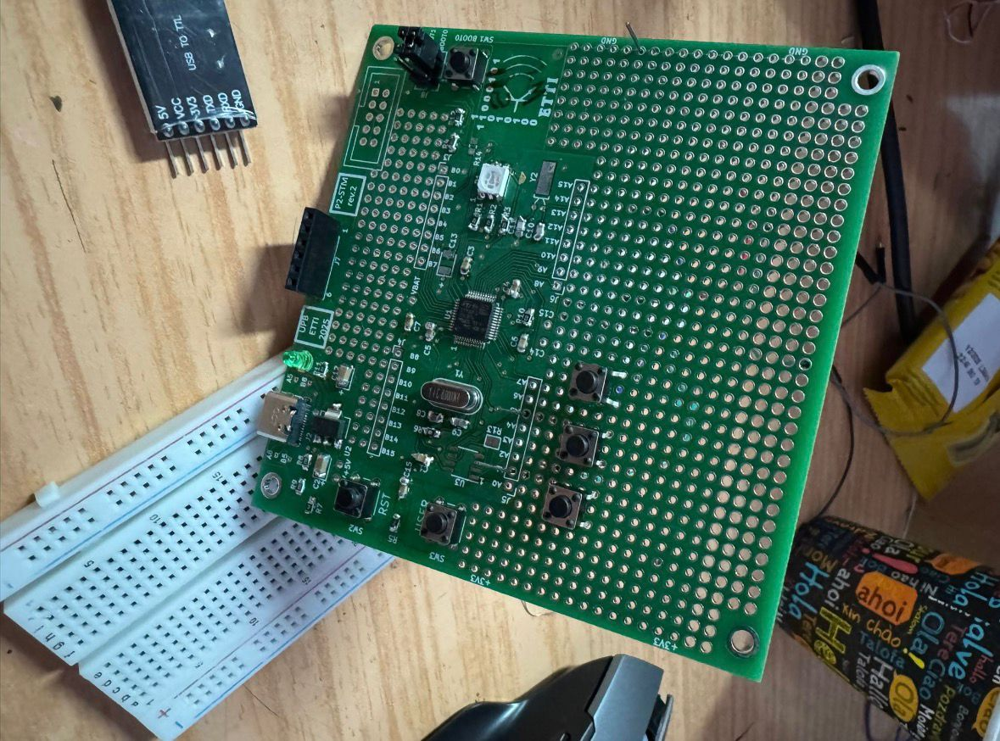
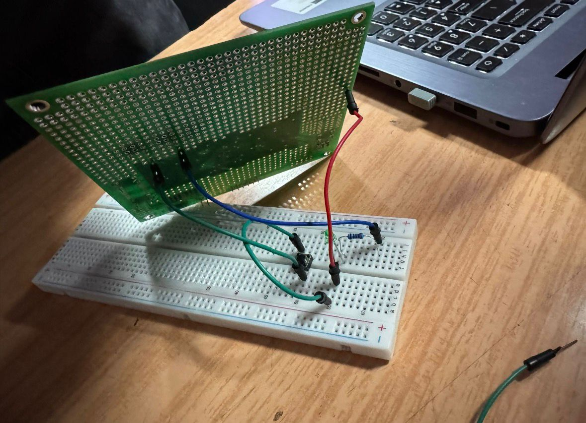
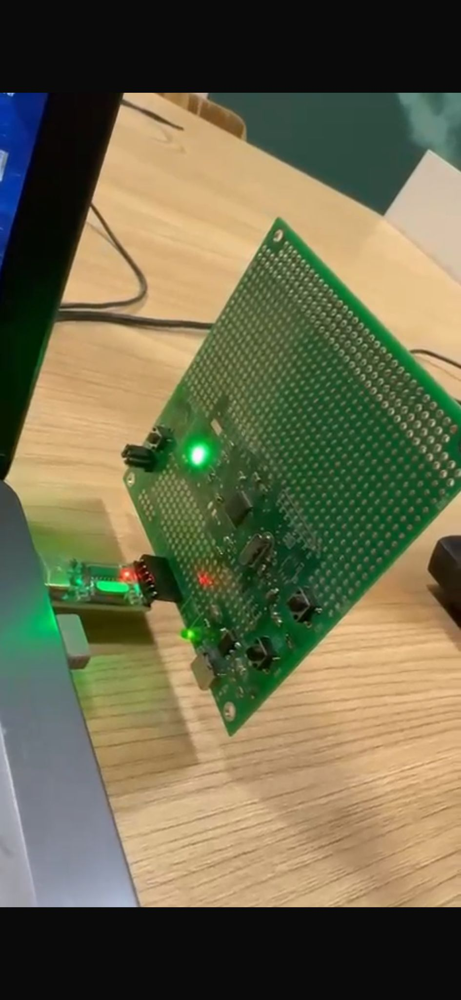

# STM32 RGB “Simon Says” Game

Embedded memory game implemented on STM32 using software PWM, button inputs, finite-state logic, UART feedback, and direct hardware validation.

## Overview

This project implements a simplified **“Simon Says” memory game** on an STM32 microcontroller platform. The system displays a predefined sequence of colors using a single RGB LED, and the user must observe, memorize, and reproduce the same pattern by pressing the corresponding color buttons in the correct order.

The demo version of the game was validated with **three levels**, each level increasing the challenge. If the player successfully reproduces the full sequence of a level, the game advances to the next one. If the player makes a mistake at any point, the game resets to **Level 1**.

The project combines embedded C programming with STM32 peripheral configuration and real hardware testing. It includes RGB LED control through software PWM, button-based user interaction, finite-state-machine logic for the game flow, and UART messages for debugging and user feedback.

## Project Objective

The objective of the project was to design and validate an embedded memory game that:

- displays color-based patterns using an RGB LED;
- allows the user to reproduce the pattern using dedicated push buttons;
- advances through multiple levels of difficulty;
- resets on incorrect input;
- provides feedback through UART messages;
- runs and is validated directly on STM32 hardware.

Although the implemented version was limited to three levels for demonstration purposes, the logic can be extended to support more levels, more complex sequences, and additional difficulty settings.

## Hardware Setup

The hardware implementation is based on an STM32 microcontroller board connected to:

- one RGB LED for visual pattern generation;
- three push buttons, each corresponding to one color:
  - Red
  - Green
  - Blue
- UART connection for serial monitoring and debugging;
- external wiring for LED and input interfacing.

In addition to the embedded software implementation, I also handled the practical hardware preparation, including component soldering, hardware assembly, wiring, and functional testing on the STM32 platform., followed by wiring and functional testing of the complete setup.

### Hardware Images

#### Top View of the Hardware Setup

#### Rear Wiring / Connections

#### Hardware During Active Demo

## Game Logic

The logic of the project follows the idea of the classic “Simon Says” game:

1. the system displays a sequence of colors;
2. the player watches and memorizes the sequence;
3. the player must press the three color buttons in the same order;
4. if the full sequence is correct, the player advances to the next level;
5. if any input is incorrect, the game resets to **Level 1**.

### Implemented Demo Behavior

In the validated demo:
- the sequence was **predefined**;
- the game was tested with **3 levels**;
- each level required the user to correctly reproduce the pattern shown by the LED;
- a wrong input at any stage caused a restart from the first level.

This structure was sufficient to demonstrate the memory-game concept, while keeping the implementation manageable and easy to validate on hardware.

## Difficulty Scaling

The game includes progressive difficulty across levels.

The main difficulty mechanism is related to the way the color sequence is displayed:
- at earlier levels, the color indications are easier to follow;
- at higher levels, the sequence is shown more quickly, so the player has less time to memorize it correctly.

This timing-based difficulty increase makes the game progressively more challenging without requiring major hardware changes.

Although the current demo uses only three levels, the same concept can be extended further by:
- increasing the number of levels;
- increasing the sequence length;
- adjusting the display timing;
- switching from predefined sequences to randomly generated ones.

## Software Architecture

The software was implemented in **Embedded C** and organized around the standard STM32 project structure generated with STM32 tools.

The source code includes configuration and application files such as:
- `main.c`
- `gpio.c`
- `tim.c`
- `usart.c`
- interrupt handling files
- STM32 support and system files

The implementation combines:
- GPIO control for LEDs and buttons;
- timer-based behavior for LED drive timing;
- finite-state-machine logic for the gameplay flow;
- UART communication for status messages.

## Finite-State-Machine Logic

A finite-state-machine approach was used to control the main game flow.

This makes the project easier to understand, test, and extend, because the application behavior is organized into clear stages such as:
- startup / initialization;
- sequence display;
- waiting for user input;
- validating user input;
- moving to next level;
- reset on failure;
- game completion.

Using an FSM structure is especially useful in embedded applications where timing, user actions, and state transitions must be handled in a predictable way.

## RGB LED Control

The visual part of the game is implemented using a **single RGB LED**.  
The LED is used to display three colors:

- Red
- Green
- Blue

These colors represent the visual sequence that the player must reproduce.

The project uses PWM-based LED control, allowing the RGB LED to be driven in a controlled and structured way through software logic. This is an important part of the system because the game relies entirely on clear and recognizable color indications.

## Button Input Handling

Each color has a corresponding push button:
- one for red
- one for green
- one for blue

The user reproduces the displayed sequence by pressing the buttons in the same order as the pattern shown by the LED.

The button-handling logic is essential because it connects the physical user action to the internal validation state of the game. A correct sequence leads to progression, while an incorrect button press causes the system to restart from Level 1.

## UART Feedback and Debugging

UART was used to provide runtime messages in the serial console. This made it easier to monitor the game state during testing and hardware validation.

Examples of UART feedback include:
- notification that the user advanced to the next level;
- confirmation when the demo sequence was completed successfully;
- final completion message similar to:
  **“Congratulations, you completed the game.”**

This serial feedback was useful both for debugging and for confirming that the internal logic matched the expected gameplay behavior.

## Validation on Hardware

The project was validated directly on physical hardware.

The following aspects were checked during testing:
- correct RGB LED behavior;
- correct response of each button input;
- proper reproduction of the predefined color pattern;
- progression through all three demo levels;
- reset behavior when the user pressed a wrong button;
- UART confirmation messages for success and progression.

Hardware validation is important because it confirms not only that the software compiles correctly, but also that the complete system behaves as intended in real conditions.

## Extensibility

Although the implemented version was designed as a demo with three levels, the project can be extended in several ways:

- more levels can be added;
- the predefined sequence can be replaced with a random one;
- longer patterns can be generated;
- difficulty can be adjusted more aggressively;
- score tracking or timing constraints can be added;
- audio or display feedback could be integrated in future versions.

This makes the project a good foundation for more advanced embedded-game development on STM32.

## Tools and Technologies Used

- **STM32**
- **STM32CubeMX**
- **Embedded C**
- **GPIO**
- **Timer configuration**
- **UART communication**
- **Finite-state-machine logic**
- **Hardware-based validation**

## Source Files

The repository includes the STM32 source files used in the project, including application logic, peripheral configuration, and support files required for execution.

## Notes

This repository documents the implementation of an STM32-based RGB memory game validated on hardware. The current version reflects a working demo with three tested levels and can be extended further into a more advanced and scalable embedded game.
